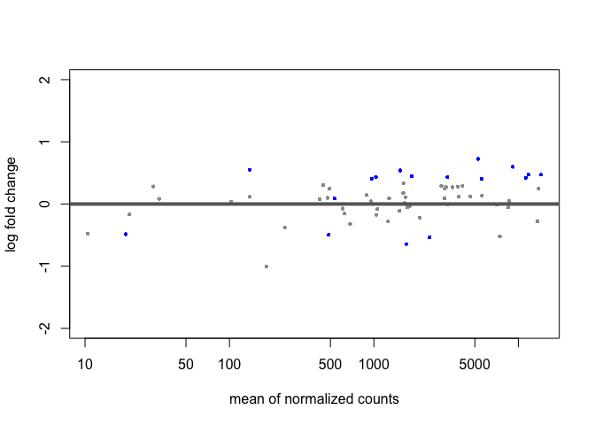
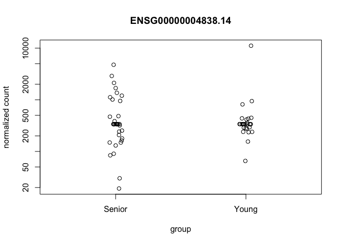
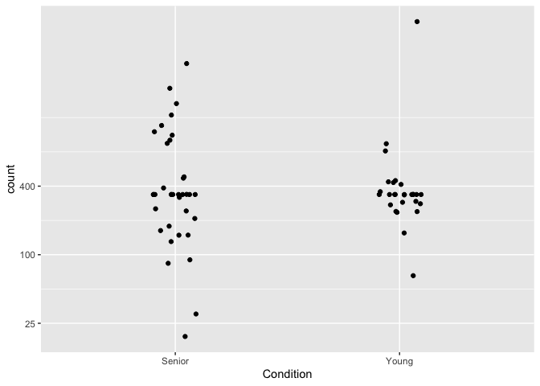
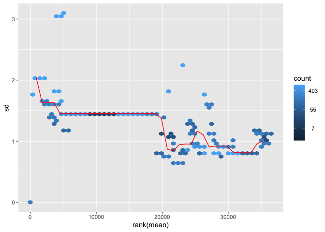
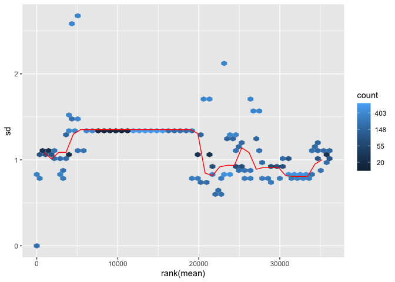
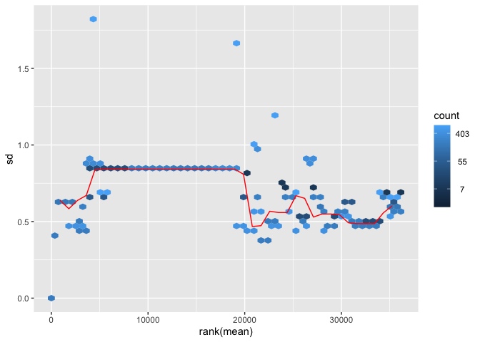
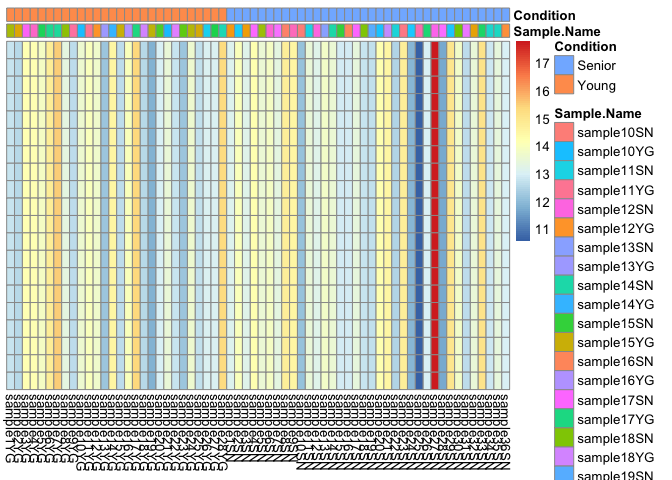
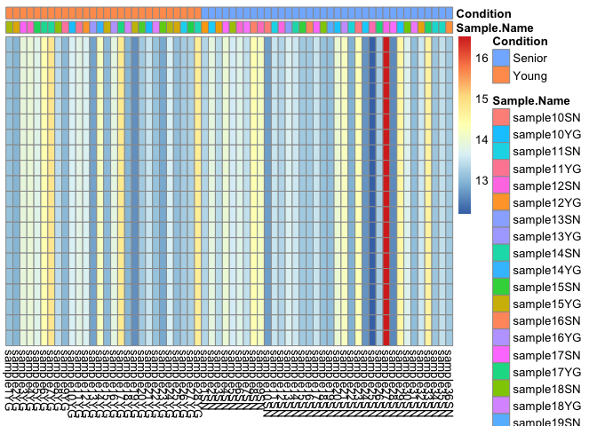
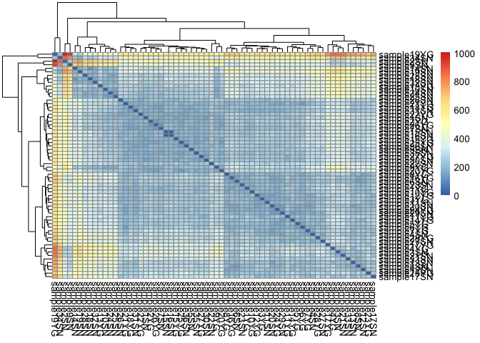
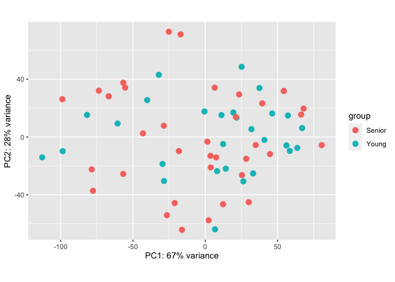

TRGN510FinalProject
================
Quinta Wang
2022-12-10

Install Deseq2

``` r
library(BiocManager)
BiocManager::install("DESeq2")
```

    ## Bioconductor version 3.16 (BiocManager 1.30.19), R 4.2.1 (2022-06-23)

    ## Warning: package(s) not installed when version(s) same as or greater than current; use
    ##   `force = TRUE` to re-install: 'DESeq2'

``` r
library(DESeq2)
```

    ## Warning: package 'DESeq2' was built under R version 4.2.2

    ## Loading required package: S4Vectors

    ## Warning: package 'S4Vectors' was built under R version 4.2.2

    ## Loading required package: stats4

    ## Loading required package: BiocGenerics

    ## 
    ## Attaching package: 'BiocGenerics'

    ## The following objects are masked from 'package:stats':
    ## 
    ##     IQR, mad, sd, var, xtabs

    ## The following objects are masked from 'package:base':
    ## 
    ##     anyDuplicated, aperm, append, as.data.frame, basename, cbind,
    ##     colnames, dirname, do.call, duplicated, eval, evalq, Filter, Find,
    ##     get, grep, grepl, intersect, is.unsorted, lapply, Map, mapply,
    ##     match, mget, order, paste, pmax, pmax.int, pmin, pmin.int,
    ##     Position, rank, rbind, Reduce, rownames, sapply, setdiff, sort,
    ##     table, tapply, union, unique, unsplit, which.max, which.min

    ## 
    ## Attaching package: 'S4Vectors'

    ## The following objects are masked from 'package:base':
    ## 
    ##     expand.grid, I, unname

    ## Loading required package: IRanges

    ## Loading required package: GenomicRanges

    ## Loading required package: GenomeInfoDb

    ## Warning: package 'GenomeInfoDb' was built under R version 4.2.2

    ## Loading required package: SummarizedExperiment

    ## Loading required package: MatrixGenerics

    ## Loading required package: matrixStats

    ## 
    ## Attaching package: 'MatrixGenerics'

    ## The following objects are masked from 'package:matrixStats':
    ## 
    ##     colAlls, colAnyNAs, colAnys, colAvgsPerRowSet, colCollapse,
    ##     colCounts, colCummaxs, colCummins, colCumprods, colCumsums,
    ##     colDiffs, colIQRDiffs, colIQRs, colLogSumExps, colMadDiffs,
    ##     colMads, colMaxs, colMeans2, colMedians, colMins, colOrderStats,
    ##     colProds, colQuantiles, colRanges, colRanks, colSdDiffs, colSds,
    ##     colSums2, colTabulates, colVarDiffs, colVars, colWeightedMads,
    ##     colWeightedMeans, colWeightedMedians, colWeightedSds,
    ##     colWeightedVars, rowAlls, rowAnyNAs, rowAnys, rowAvgsPerColSet,
    ##     rowCollapse, rowCounts, rowCummaxs, rowCummins, rowCumprods,
    ##     rowCumsums, rowDiffs, rowIQRDiffs, rowIQRs, rowLogSumExps,
    ##     rowMadDiffs, rowMads, rowMaxs, rowMeans2, rowMedians, rowMins,
    ##     rowOrderStats, rowProds, rowQuantiles, rowRanges, rowRanks,
    ##     rowSdDiffs, rowSds, rowSums2, rowTabulates, rowVarDiffs, rowVars,
    ##     rowWeightedMads, rowWeightedMeans, rowWeightedMedians,
    ##     rowWeightedSds, rowWeightedVars

    ## Loading required package: Biobase

    ## Welcome to Bioconductor
    ## 
    ##     Vignettes contain introductory material; view with
    ##     'browseVignettes()'. To cite Bioconductor, see
    ##     'citation("Biobase")', and for packages 'citation("pkgname")'.

    ## 
    ## Attaching package: 'Biobase'

    ## The following object is masked from 'package:MatrixGenerics':
    ## 
    ##     rowMedians

    ## The following objects are masked from 'package:matrixStats':
    ## 
    ##     anyMissing, rowMedians

``` r
library(ggplot2)
```

Load all data including the gene id, unstranded data and sample name and
condition.

``` r
data <- read.delim("~/Desktop/backup/merge_file.txt", header = TRUE, sep = "\t")
samplename  <- read.delim("~/Desktop/TRGN510FinalProjectTSV - Sheet1.tsv", header = TRUE, sep = "\t")
```

``` r
samplename$Condition <- as.factor(samplename$Condition)
```

``` r
row.names(data) <- data$gene_id
data <- data[-c(1)]
```

``` r
DES_data <- DESeqDataSetFromMatrix(countData = data,
                                   colData = samplename,
                                   design = ~ Condition)
```

``` r
DES_data <- DES_data[rowSums(counts(DES_data) > 10),]
```

``` r
dds <- DESeq(DES_data)
```

    ## estimating size factors

    ## estimating dispersions

    ## gene-wise dispersion estimates

    ## mean-dispersion relationship

    ## final dispersion estimates

    ## fitting model and testing

    ## -- replacing outliers and refitting for 15267 genes
    ## -- DESeq argument 'minReplicatesForReplace' = 7 
    ## -- original counts are preserved in counts(dds)

    ## estimating dispersions

    ## fitting model and testing

``` r
res <- results(dds)
res
```

    ## log2 fold change (MLE): Condition Young vs Senior 
    ## Wald test p-value: Condition Young vs Senior 
    ## DataFrame with 36143 rows and 6 columns
    ##                     baseMean log2FoldChange     lfcSE      stat     pvalue
    ##                    <numeric>      <numeric> <numeric> <numeric>  <numeric>
    ## ENSG00000004838.14  533.1495      -0.916846  0.313648 -2.923171 0.00346486
    ## ENSG00000002079.14   32.5026       0.144350  0.341759  0.422374 0.67275180
    ## ENSG00000004838.14  533.1495      -0.916846  0.313648 -2.923171 0.00346486
    ## ENSG00000004838.14  533.1495      -0.916846  0.313648 -2.923171 0.00346486
    ## ENSG00000004838.14  533.1495      -0.916846  0.313648 -2.923171 0.00346486
    ## ...                      ...            ...       ...       ...        ...
    ## ENSG00000004809.14   19.1498      -0.822334  0.368756 -2.230026 0.02574571
    ## ENSG00000004779.10 5285.9827       0.828818  0.255570  3.243022 0.00118269
    ## ENSG00000004838.14  533.1495      -0.916846  0.313648 -2.923171 0.00346486
    ## ENSG00000002587.10  608.6370      -0.109117  0.282659 -0.386038 0.69946832
    ## ENSG00000004766.17 1275.7150       0.116239  0.205591  0.565391 0.57180806
    ##                          padj
    ##                     <numeric>
    ## ENSG00000004838.14 0.00886458
    ## ENSG00000002079.14 0.73848432
    ## ENSG00000004838.14 0.00886458
    ## ENSG00000004838.14 0.00886458
    ## ENSG00000004838.14 0.00886458
    ## ...                       ...
    ## ENSG00000004809.14 0.05448458
    ## ENSG00000004779.10 0.00886458
    ## ENSG00000004838.14 0.00886458
    ## ENSG00000002587.10 0.76248095
    ## ENSG00000004766.17 0.65291636

# Log fold change shrinkage for visualization and ranking

``` r
res <- results(dds, name="Condition_Young_vs_Senior")
res <- results(dds, contrast=c("Condition","Young","Senior"))
```

``` r
resultsNames(dds)
```

    ## [1] "Intercept"                 "Condition_Young_vs_Senior"

``` r
BiocManager::install("apeglm")
```

    ## Bioconductor version 3.16 (BiocManager 1.30.19), R 4.2.1 (2022-06-23)

    ## Warning: package(s) not installed when version(s) same as or greater than current; use
    ##   `force = TRUE` to re-install: 'apeglm'

``` r
library(apeglm)
```

``` r
resLFC <- lfcShrink(dds, coef="Condition_Young_vs_Senior", type="apeglm")
```

    ## using 'apeglm' for LFC shrinkage. If used in published research, please cite:
    ##     Zhu, A., Ibrahim, J.G., Love, M.I. (2018) Heavy-tailed prior distributions for
    ##     sequence count data: removing the noise and preserving large differences.
    ##     Bioinformatics. https://doi.org/10.1093/bioinformatics/bty895

``` r
resLFC
```

    ## log2 fold change (MAP): Condition Young vs Senior 
    ## Wald test p-value: Condition Young vs Senior 
    ## DataFrame with 36143 rows and 5 columns
    ##                     baseMean log2FoldChange     lfcSE     pvalue       padj
    ##                    <numeric>      <numeric> <numeric>  <numeric>  <numeric>
    ## ENSG00000004838.14  533.1495      0.0890736  0.249026 0.00346486 0.00886458
    ## ENSG00000002079.14   32.5026      0.0838075  0.262830 0.67275180 0.73848432
    ## ENSG00000004838.14  533.1495      0.0890736  0.249026 0.00346486 0.00886458
    ## ENSG00000004838.14  533.1495      0.0890736  0.249026 0.00346486 0.00886458
    ## ENSG00000004838.14  533.1495      0.0890736  0.249026 0.00346486 0.00886458
    ## ...                      ...            ...       ...        ...        ...
    ## ENSG00000004809.14   19.1498     -0.4855378  0.354504 0.02574571 0.05448458
    ## ENSG00000004779.10 5285.9827      0.7245328  0.259662 0.00118269 0.00886458
    ## ENSG00000004838.14  533.1495      0.0890736  0.249026 0.00346486 0.00886458
    ## ENSG00000002587.10  608.6370     -0.0722980  0.232463 0.69946832 0.76248095
    ## ENSG00000004766.17 1275.7150      0.0922678  0.183989 0.57180806 0.65291636

# p-values and adjusted p-values

``` r
resOrdered <- res[order(res$pvalue),]
```

``` r
summary(res)
```

    ## 
    ## out of 35951 with nonzero total read count
    ## adjusted p-value < 0.1
    ## LFC > 0 (up)       : 2768, 7.7%
    ## LFC < 0 (down)     : 15440, 43%
    ## outliers [1]       : 0, 0%
    ## low counts [2]     : 0, 0%
    ## (mean count < 10)
    ## [1] see 'cooksCutoff' argument of ?results
    ## [2] see 'independentFiltering' argument of ?results

``` r
sum(res$padj < 0.1, na.rm = TRUE)
```

    ## [1] 18208

``` r
res05 <- results(dds, alpha=0.05)
summary(res05)
```

    ## 
    ## out of 35951 with nonzero total read count
    ## adjusted p-value < 0.05
    ## LFC > 0 (up)       : 1895, 5.3%
    ## LFC < 0 (down)     : 14149, 39%
    ## outliers [1]       : 0, 0%
    ## low counts [2]     : 4013, 11%
    ## (mean count < 421)
    ## [1] see 'cooksCutoff' argument of ?results
    ## [2] see 'independentFiltering' argument of ?results

``` r
sum(res05$padj < 0.05, na.rm=TRUE)
```

    ## [1] 16044

# Exploring and exporting results

\##MA-plot

``` r
plotMA(resLFC, ylim=c(-2,2))
```

<!-- -->
\# Plot counts

``` r
plotCounts(dds, gene=which.min(res$padj), intgroup="Condition")
```

<!-- -->

``` r
d <- plotCounts(dds, gene=which.min(res$padj), intgroup="Condition", 
                returnData=TRUE)
ggplot(d, aes(x=Condition, y=count)) + 
  geom_point(position=position_jitter(w=0.1,h=0)) + 
  scale_y_log10(breaks=c(25,100,400))
```

<!-- -->

# Exporting results to CSV files

``` r
write.csv(as.data.frame(resOrdered), 
          file="Condition_age_results.csv")
```

``` r
resSig <- subset(resOrdered, padj < 0.1)
resSig
```

    ## log2 fold change (MLE): Condition Young vs Senior 
    ## Wald test p-value: Condition Young vs Senior 
    ## DataFrame with 18208 rows and 6 columns
    ##                     baseMean log2FoldChange     lfcSE      stat     pvalue
    ##                    <numeric>      <numeric> <numeric> <numeric>  <numeric>
    ## ENSG00000004779.10   5285.98       0.828818   0.25557   3.24302 0.00118269
    ## ENSG00000004779.10   5285.98       0.828818   0.25557   3.24302 0.00118269
    ## ENSG00000004779.10   5285.98       0.828818   0.25557   3.24302 0.00118269
    ## ENSG00000004779.10   5285.98       0.828818   0.25557   3.24302 0.00118269
    ## ENSG00000004779.10   5285.98       0.828818   0.25557   3.24302 0.00118269
    ## ...                      ...            ...       ...       ...        ...
    ## ENSG00000004059.11   11249.2       0.547945  0.275709    1.9874  0.0468776
    ## ENSG00000004059.11   11249.2       0.547945  0.275709    1.9874  0.0468776
    ## ENSG00000004059.11   11249.2       0.547945  0.275709    1.9874  0.0468776
    ## ENSG00000004059.11   11249.2       0.547945  0.275709    1.9874  0.0468776
    ## ENSG00000004059.11   11249.2       0.547945  0.275709    1.9874  0.0468776
    ##                          padj
    ##                     <numeric>
    ## ENSG00000004779.10 0.00886458
    ## ENSG00000004779.10 0.00886458
    ## ENSG00000004779.10 0.00886458
    ## ENSG00000004779.10 0.00886458
    ## ENSG00000004779.10 0.00886458
    ## ...                       ...
    ## ENSG00000004059.11  0.0925579
    ## ENSG00000004059.11  0.0925579
    ## ENSG00000004059.11  0.0925579
    ## ENSG00000004059.11  0.0925579
    ## ENSG00000004059.11  0.0925579

``` r
vsd <- vst(dds, blind=FALSE)
rld <- rlog(dds, blind=FALSE)
```

    ## rlog() may take a long time with 50 or more samples,
    ## vst() is a much faster transformation

``` r
head(assay(vsd), 3)
```

    ##                    sample1YG sample2YG sample3YG sample4YG sample5YG sample6YG
    ## ENSG00000004838.14  8.483574  8.763651  8.483574  6.404488  8.483574  8.295815
    ## ENSG00000002079.14  5.083721  4.571977  7.163157  5.702299  4.275290  6.336868
    ## ENSG00000004838.14  8.483574  8.763651  8.483574  6.404488  8.483574  8.295815
    ##                    sample7YG sample8YG sample9YG sample10YG sample11YG
    ## ENSG00000004838.14  8.230998  8.018347  9.705972   8.483574   8.483574
    ## ENSG00000002079.14  6.401565  4.463876  5.379476   5.912649   5.296480
    ## ENSG00000004838.14  8.230998  8.018347  9.705972   8.483574   8.483574
    ##                    sample12YG sample13YG sample14YG sample15YG sample16YG
    ## ENSG00000004838.14   8.270573   9.911996   8.483574   8.561578   8.022585
    ## ENSG00000002079.14   6.027343   5.713918   5.618757   6.224571   3.395169
    ## ENSG00000004838.14   8.270573   9.911996   8.483574   8.561578   8.022585
    ##                    sample17YG sample18YG sample19YG sample20YG sample21YG
    ## ENSG00000004838.14   7.451910   8.483574  13.445716   8.816196   8.483574
    ## ENSG00000002079.14   7.208483   5.566604   5.641719   5.785792   5.528928
    ## ENSG00000004838.14   7.451910   8.483574  13.445716   8.816196   8.483574
    ##                    sample22YG sample23YG sample24YG sample25YG sample26YG
    ## ENSG00000004838.14   8.870150   8.200116   8.472883   8.487256   8.835915
    ## ENSG00000002079.14   5.422793   4.542410   5.118621   6.296012   4.804858
    ## ENSG00000004838.14   8.870150   8.200116   8.472883   8.487256   8.835915
    ##                    sample27YG sample28YG sample1SN sample2SN sample3SN
    ## ENSG00000004838.14   8.483574   7.998331  8.937681  5.196187  6.777664
    ## ENSG00000002079.14   4.295113   5.049420  4.788652  5.313408  7.069996
    ## ENSG00000004838.14   8.483574   7.998331  8.937681  5.196187  6.777664
    ##                    sample4SN sample5SN sample6SN sample7SN sample8SN sample9SN
    ## ENSG00000004838.14  8.093454  8.483574  7.833389  8.974533  7.514254  5.597371
    ## ENSG00000002079.14  6.611498  4.246131  5.937847  4.646223  5.137499  4.863039
    ## ENSG00000004838.14  8.093454  8.483574  7.833389  8.974533  7.514254  5.597371
    ##                    sample10SN sample11SN sample12SN sample13SN sample14SN
    ## ENSG00000004838.14  10.156241   8.483574   7.629964   7.230472   11.06573
    ## ENSG00000002079.14   4.569601   5.438462   4.677928   6.270552    4.97286
    ## ENSG00000004838.14  10.156241   8.483574   7.629964   7.230472   11.06573
    ##                    sample15SN sample16SN sample17SN sample18SN sample19SN
    ## ENSG00000004838.14   8.483574   8.483574   7.397010  10.735323  11.508490
    ## ENSG00000002079.14   4.735560   4.735560   6.244673   4.370913   5.207817
    ## ENSG00000004838.14   8.483574   8.483574   7.397010  10.735323  11.508490
    ##                    sample20SN sample21SN sample22SN sample23SN sample24SN
    ## ENSG00000004838.14   8.035341   6.693973   8.664427   8.483574   9.922350
    ## ENSG00000002079.14   5.478702   6.693973   4.312087   4.893061   4.435061
    ## ENSG00000004838.14   8.035341   6.693973   8.664427   8.483574   9.922350
    ##                    sample25SN sample26SN sample27SN sample28SN sample29SN
    ## ENSG00000004838.14  10.012474   8.483574   8.405518  10.255390   8.483574
    ## ENSG00000002079.14   4.468439   6.228114   6.339429   4.964337   7.095903
    ## ENSG00000004838.14  10.012474   8.483574   8.405518  10.255390   8.483574
    ##                    sample30SN sample31SN sample32SN sample33SN sample34SN
    ## ENSG00000004838.14   8.483574   8.483574  10.435315   7.394678  12.225678
    ## ENSG00000002079.14   5.209210   4.709005   4.421926   6.824645   5.902309
    ## ENSG00000004838.14   8.483574   8.483574  10.435315   7.394678  12.225678
    ##                    sample35SN sample36SN
    ## ENSG00000004838.14   8.483574   8.487807
    ## ENSG00000002079.14   5.505067   5.464444
    ## ENSG00000004838.14   8.483574   8.487807

``` r
BiocManager::install("vsn")
```

    ## Bioconductor version 3.16 (BiocManager 1.30.19), R 4.2.1 (2022-06-23)

    ## Warning: package(s) not installed when version(s) same as or greater than current; use
    ##   `force = TRUE` to re-install: 'vsn'

# Effects of transformations on the variance

``` r
ntd <- normTransform(dds)
library("vsn")
meanSdPlot(assay(ntd))
```

<!-- -->

``` r
meanSdPlot(assay(vsd))
```

<!-- -->

``` r
meanSdPlot(assay(rld))
```

<!-- -->

``` r
BiocManager::install("pheatmap")
```

    ## Bioconductor version 3.16 (BiocManager 1.30.19), R 4.2.1 (2022-06-23)

    ## Warning: package(s) not installed when version(s) same as or greater than current; use
    ##   `force = TRUE` to re-install: 'pheatmap'

# Heatmap of the count matrix

# Heatmap with normal transform

``` r
library("pheatmap")
select <- order(rowMeans(counts(dds,normalized=TRUE)),
                decreasing=TRUE)[1:20]
df <- as.data.frame(colData(dds)[,c("Sample.Name", "Condition")])
pheatmap(assay(ntd)[select,], cluster_rows=FALSE, show_rownames=FALSE,
         cluster_cols=FALSE, annotation_col=df)
```

<!-- -->
\# Heatmap with variance stablizing transformation

``` r
pheatmap(assay(vsd)[select,], cluster_rows=FALSE, show_rownames=FALSE,
         cluster_cols=FALSE, annotation_col=df)
```

<!-- -->

# Heatmap with regularized log transformation

``` r
pheatmap(assay(rld)[select,], cluster_rows=FALSE, show_rownames=FALSE,
         cluster_cols=FALSE, annotation_col=df)
```

<!-- -->
\# Heatmap of the sample-to-sample distances

``` r
sampleDists <- dist(t(assay(vsd)))
DistMatrix <- as.matrix(sampleDists)
pheatmap(DistMatrix)
```

<!-- -->
\# Principal component plot of the samples

``` r
plotPCA(vsd, intgroup=c("Condition"))
```

<!-- -->
